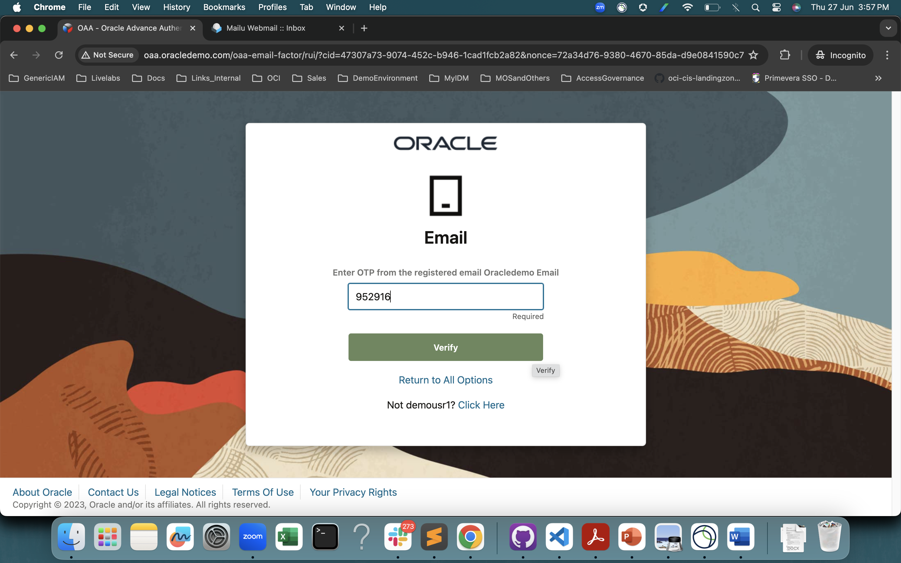

# Create  OCI Policies, VCN, Groups and Compartments

## Introduction

As an end-user having access to the sample web application, you can authenticate into the app with Email OTP as the second factor authentication. This lab will walk through the flow of providing username and password along with Email OTP received as part of the email client.

As one of the demo users, which is already pre-seeded in the environment, you will access the sample web application. Upon entering username and password, you would be redirected to choose email OTP for the second factor authentication. You would grab the OTP from the pre-configured web email client. Upon providing the OTP, you would be successfully he sample web application.

* Estimated Time: 15 minutes
* Persona: End-User

## Objectives

In this lab, you will:

* Access the sample web application using multi factor authentication

  *Note:* All the demo users and apps have been pre-seeded to perform the use-cases

## Prerequisites

This lab assumes you have:

* Oracle Mobile Authenticator installed in your mobile device. Follow the respective link below to install the application :

     [OMA on Google Store](https://play.google.com/store/apps/details?id=oracle.idm.mobile.authenticator&hl=en_CA&gl=US)

     [OMA on Apple Store](https://apps.apple.com/us/app/oracle-mobile-authenticator/id835904829)

* A test account registered in OMA. Use the following instructions to do that :

    1. Open OMA in your mobile device

    2. If this is the first time accessing OMA, click on Add Account, otherwise tap the plus (+) icon at the bottom of the screen

    3. Then tap on **Enter key manually** link

    4. In Select Account Type, choose Oracle. Then, enter the following information:

      Company : **Oracle** 

      Account

        ```
        <copy>
        Demo User1
        </copy>
        ```

      Key

        ```
        <copy>
        DemoAppUsrOne
        </copy>
        ```

    5. Tap on Save button to register the account.

## Task 1: Update host machine to access web consoles in the demo environment

1. Login to the OCI console Identity Domain: Choose the right domain and login as the **Identity Domain Administrator**

  

2. In the OCI console, click the Navigation Menu icon in the top left corner to display the Navigation menu. Under Compute, Click Instances. Select the correct compartment to display the compute instance that was deployed as part of **Lab2**.

  

3. Add the following entries in your computer's hosts file.

   *Note :* In case of Windows, the location is ***C:\Windows\System32\drivers\etc\hosts***. In case of Mac, the location is ***\etc\hosts***.

   *Note :* Replace <PUBLIC_IP> with the IP of the OUA compute instance from the OCI console.

    ```
    <copy>
    <PUBLIC_IP>    so92-srv1.oracledemo.com iamdb.oracledemo.com oud.oracledemo.com oam.oracledemo.com aso.oracledemo.com oaa.oracledemo.com ora.oracledemo.com oim.oracledemo.com mail.oracledemo.com
    <PUBLIC_IP>    oiri.oracledemo.com grafana.oracledemo.com prometheus.oracledemo.com oap.oracledemo.com oudsm.oracledemo.com ade.oracledemo.com demodb.oracledemo.com
    </copy>
    ```

## Task 2: Authenticate into sample web app using email otp

1. Open your preferred browser. Access the **Email Client** using below details. This would be used to receive OTPs :
   *Note :* You might notice a certificate related warning saying 'Your connection is not private'. This happens because the demo environment uses self-signed certificates. You can click 'Advanced' and 'Proceed to mail.oracledemo.com'.

  Mailu Email Console:
    ```
    <copy>
    https://mail.oracledemo.com/
    </copy>
    ```

  User
    ```
    <copy>
    demousr1@oracledemo.com
    </copy>
    ```

  Password
    ```
    <copy>
    Oracle123
    </copy>
    ```

  Choose **Sign in Webmail**.

2. Open a new browser tab. Access the sample web app using below details and Click Login :

  Sample Web App:
    ```
    <copy>
    http://ade.oracledemo.com/demoapp/index.html
    </copy>
    ```

  User
    ```
    <copy>
    demousr1
    </copy>
    ```

  Password
    ```
    <copy>
    Oracle123
    </copy>
    ```
3. Click on the link below 'Email Challenge' to receive email OTP as the second factor :

   

4. Goto the email client to receive the newly delivered OTPs. This might take around 30 secs to a minute for OTP to get delivered. You could try refreshing the mailbox by clicking on **Refresh** button or reloading the browser page itself.

5. Provide the OTP in the login flow. Click Verify

   

6. You should be redirected to the sample app landing page after successful authentication

*Note :* At this point, you should sign out from the application as you would be authenticating again with a different MFA factor.

## Task 3: Authenticate into sample web app using otp from OMA app

1. In a new browser window, access the sample web app as described in Task 2: Step 2

2. Click on the link below 'Oracle Mobile Authenticator' to receive OTP on your mobile app

   

3. Provide the OTP in the login flow. Click Verify

   

4. You should be redirected to the sample app landing page after successful authentication

  You may now **proceed to the next lab**.

## Learn More

* [Oracle Access Governance Create Access Review Campaign](https://docs.oracle.com/en/cloud/paas/access-governance/pdapg/index.html)
* [Oracle Access Governance Product Page](https://www.oracle.com/security/cloud-security/access-governance/)
* [Oracle Access Governance Product tour](https://www.oracle.com/webfolder/s/quicktours/paas/pt-sec-access-governance/index.html)
* [Oracle Access Governance FAQ](https://www.oracle.com/security/cloud-security/access-governance/faq/)

## Acknowledgments

* **Authors** - Anuj Tripathi

* **Last Updated By/Date** - Anuj Tripathi, North America Platform Specialist, June 2024
