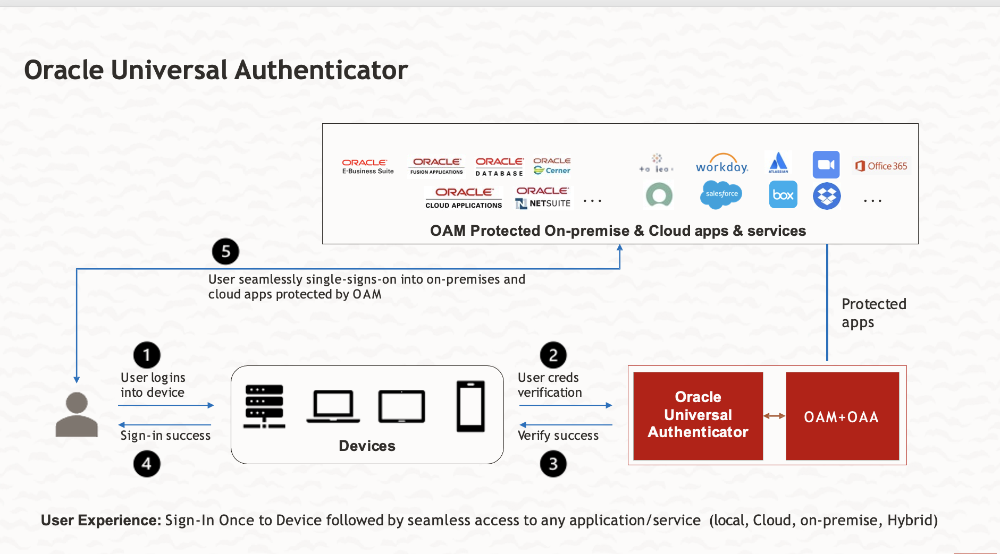

# Introduction

## About this Workshop

 OOracle Universal Authenticator is a unified authentication solution that provides device authentication and cross-platform single-sign on (SSO) to web-based and desktop applications.

Users login to their devices using either password-less login, or with their Oracle Access Management (OAM) credentials. Users can then access protected applications without the need to enter their single-sign on credentials again.

Oracle Universal Authenticator provides phishing-resistant MFA and passwordless protection for devices and applications, strengthening your organization's security framework and preventing phishing attacks. This comprehensive solution works seamlessly with Oracle Access Manager (OAM) by leveraging Oracle Advanced Authentication (OAA) and Oracle Adaptive Risk Management (OARM) as an integrated suite to provide the SSO experience from trusted devices to all entitled applications using various authentication methods.

Key Features:

* Trusted Device Login with SSO: Secure access to all entitled applications from trusted devices.
* Diverse Authentication Methods: Includes MFA, passwordless, adaptive, and mobile authentication for devices and applications.
* Central Self-Service Management: Offers options for self-service authentication factors.
* Centralized Administration: Extends OAA Admin console for granular rule management for step-up authentications.

 The graphic below shows the high level architectural flow of Oracle Universal Authenticator.

  

This lab walks you through the steps to demonstrate and experience the seamless, flexible and secure authentication flow using **Oracle Universal Authenticator** in combination with **Oracle Advanced Authentication**. In this workshop, a fictitious corporation is using **Oracle IAM solution** to streamline and secure the authentication posture for their applications. As part of their cloud strategy, they want to defend against evolving threats while ensuring a seamless user access experience from various devices. Overall, Oracle Universal Authenticator addresses the evolving security challenges faced by businesses in the digital age, offering a practical solution for ensuring security and usability across various endpoints and applications.

*Estimated Time:* 1 Hour

### Objectives

In this workshop, you will learn how to:

* Authenticate with MFA using OAA
* Register your device and authenticate using Oracle Mobile Authenticator mobile app
* Prepare your system for authentication using OUA
* Authenticate to Windows device using OUA
* Authenticate to web and desktop app using OUA

### Prerequisites

This lab assumes you have:

* A tenancy where you have administrative access

## Learn More

* [Oracle Access Governance Product Page](https://www.oracle.com/security/cloud-security/access-governance/)
* [Oracle Access Governance Documentation](https://docs.oracle.com/en/cloud/paas/access-governance/index.html)
* [Oracle Access Governance Product tour](https://www.oracle.com/webfolder/s/quicktours/paas/pt-sec-access-governance/index.html)
* [Oracle Access Governance FAQ](https://www.oracle.com/security/cloud-security/access-governance/faq/)
* [Oracle Access Governance Announcement Blog](https://blogs.oracle.com/cloudsecurity/post/intelligent-cloud-delivered-access-governance-with-prescriptive-analytics)

## Acknowledgments

* **Authors** - Anuj Tripathi

* **Last Updated By/Date** - Anuj Tripathi, North America Platform Specialist, June 2024
