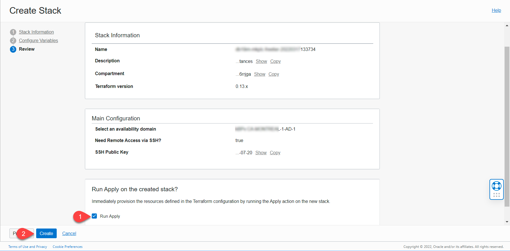
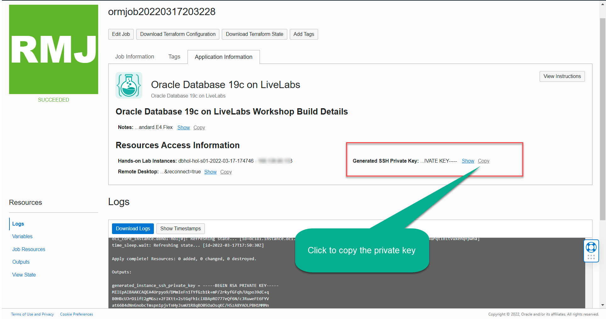

# Prepare environment

## Introduction

This lab shows steps on how to download and deploy the Oracle Resource Manager (ORM) stack zip file needed to set up the resources needed to run this workshop.

* Estimated Time: 30 minutes
* Persona: OCI Administrator

### Objectives

* Download ORM stack
* Create and configure virtual cloud network and subnets
* Create terraform stack
* Apply terraform stack

### Prerequisites

This lab assumes you have:

* An Oracle Cloud account where you have administrative access

## Task 1: Download Oracle Resource Manager (ORM) stack zip file

1. Click on the link below to download the Resource Manager zip file you need to build your environment:

    * [oua.zip](object-storage-link)

2. Save in your downloads folder.

## Task 2: Create VCN and subnets

1. Login to your OCI Console.

  ***Note :*** These instructions assumes you are deploying the environment/VM with public IP. However, a deployment with private IP is possible using a jump server or bastion host to access the instance.

2. From the infrastructure console Menu select **Networking -> VCN**.
    Click on Create VCN button and enter the required information.

    ***Note :*** **my\_compartment** is a placeholder for the compartment. This step assumes you have an existing compartment that could be leveraged for placing VCN and other resources. You can also choose the **root** compartment, even though that's not recommended. You can also create a new compartment in advance and use it to place VCN and associated resources.

    ```
    Name             : my-vcn
    Compartment      : <my_compartment>
    CIDR Block       : 10.2.0.0/16
    ```

    Click on **Create VCN**.

3. Edit the newly created VCN and proceed to create a security list.

    ```
    Name             : my-vcn-list

    Ingress Rules
    STATELESS    SOURCE          IP PROTOCOL         SOURCE PORT    DESTINATION PORT
    No           10.2.0.0/16     All Protocols
    No           0.0.0.0/0       TCP                 All            22
    No           0.0.0.0/0       ICMP
    No           <my_ip_v4>/32    All Protocols

    Egress Rules
    STATELESS    DESTINATION     IP PROTOCOL         SOURCE PORT    DESTINATION PORT
    No           0.0.0.0/0       All Protocols
    ```

  ***Note :*** **my\_ip\_v4** is the public IPv4 address assigned by your internet provider. You can find this address by searching **My IPv4 Address** in your internet browser.

4. Create two regional subnets: public and private. Use the below values:

    ```
    SUBNET NAME       TYPE           CIDR            ACCESS     SECURITY LIST
    so-pub-sn1        Regional       10.2.1.0/24     Public     my-vcn-list
    so-pri-sn1        Regional       10.2.10.0/24    Private    my-vcn-list
    ```

5. Create an internet gateway
    E.g. enter the following values:

    ```
    Name           : my-gateway
    Compartment    : <my_compartment>
    ```

6. Edit the default route table Default Route Table for my-vcn and add the gateway as route rule, using the following values:

    ```
    Target Type               : Internet Gateway
    Destination CIDR Block    : 0.0.0.0/0
    Target Internet Gateway   : my-gateway
    ```

## Task 3: Create Terraform Stack

1. Identify the ORM stack zip file downloaded in *Task 1*
2. Log in to Oracle Cloud, if not already logged in
3. Open up the hamburger menu in the top left corner.  Click **Developer Services**, and choose **Resource Manager > Stacks**. Choose the compartment in which you would like to install the stack. Click **Create Stack**.

  

  

4. Select **My Configuration**, choose the **.Zip file** button, click the **Browse** link, and select the zip file that you downloaded or drag-n-drop for the file explorer.

  

5. Click **Next**

6. Enter the following values by referring to the snips below:

    * **Instance Count:** Accept the default: **1**
    * **Select an Availability Domain:** Select an availability domain from the dropdown list.
    * **Need Remote Access via SSH?** Check **Need Remote Access via SSH?**

    Check **Auto Generate SSH Key Pair** to auto-generate an SSH key pair.
        If you have an existing SSH key pair, keep this unchecked **Auto Generate SSH Key Pair** and provide the SSH public key(s).

      **SSH Public Key**: Select from the following two options
        **Paste SSH Keys**: Paste the plaintext key strings or
        **Choose SSH Key Files**: Drag-n-drop or browse and select valid public keys of **openssh** format from your computer

    * **Use Flexible Instance Shape with Adjustable OCPU Count?:** Keep this **checked**
    * **Instance Shape:** Choose **VM.Standard.E4.Flex**.
    * **Select OCPUs Count per Instance:** Choose **4** and **128GB** of memory.

        ***Note :*** You must adjust the VM.Standard.E4.Flex shape to use 4 OCPU and 128 GB of memory, otherwise you won't be able to start all the components deployed in the server.

    * Select **Use Existing VCN?:**. Choose VCN as **my-vcn** and subnet as **so-pub-sn1** as created in **Task 2**

  
  

8. Click **Next** and proceed to next task to Apply the stack.

## Task 4: Apply Terraform Stack

1. Select **Run Apply** and click **Create**.

  

2. Your stack has now been created and the *Apply* action triggered is running to deploy your environment.
   Review the job output.

  

3. Congratulations, your environment has been created!  Click the **Application Information** tab to get additional information about what you have just done.

4. Your public IP address(es), instance name(s), along with other details will be displayed.

## Appendix 1: Use Auto-generated SSH Keys to Connect to Your Instance via an SSH Terminal

If you elected to auto-generate the SSH key pair at provisioning, proceed as indicated below.

In this example, we will be illustrating a connection from a Unix-style terminal such as *Mobaxterm*, MacOS terminal, etc.. For *Putty* on Windows, please refer to the guide [Generate SSH Keys](https://oracle-livelabs.github.io/common/labs/generate-ssh-key) on how to convert the key to the required *.ppk* format.

1. Click *Copy* to get the private key and paste it into a file on the system with an SSH client where you intend to initiate the connection. e.g. *mykey_rsa*.

    

2. Restrict the permissions on the file to *0600*

    ```text
    <copy>
    chmod 600 mykey_rsa
    </copy>
    ```

    

3. Connect to your instance using the key.

    ```text
    <copy>
    ssh -i <path to mykey_rsa> opc@<my instance public IP>
    </copy>
    ```

    

You may now **proceed to the next lab**.

## Learn More

* [Oracle Universal Authenticator Product Documentation](https://docs.oracle.com/en/middleware/idm/universal-authenticator/)

* [Oracle Universal Authenticator System Architecture](https://docs.oracle.com/en/middleware/idm/universal-authenticator/ouaad/system-architecture-and-components.html)

* [Oracle Advanced Authentication](https://docs.oracle.com/en/middleware/idm/advanced-authentication/oaarm/introducing-oaa.html)

## Acknowledgements

* **Created By/Date** - Anuj Tripathi, North America Platform Specialist (IAM/Cloud), July 2024

* **Last Updated By** - Anuj Tripathi, July 2024
